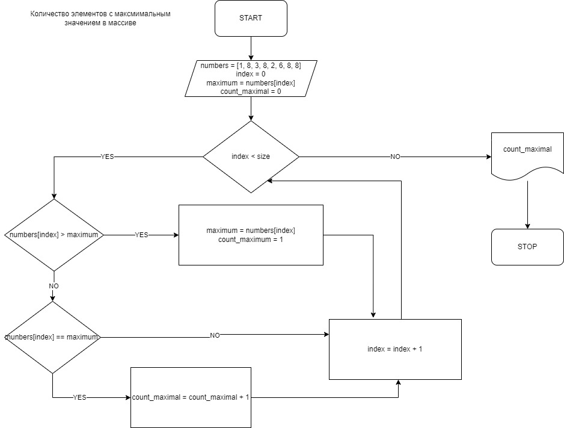

# Markdown

## Выделение текста
Что бы выделить используется (**) или (__) с двух строн
Например **Вот так** или __Вот так__
Что бы текст курсивом был используй (*) или (_)
Например *Вот так* или _Вот так_
Хочешь совмещай
Например **_Вот так_**

Хочешь зачеркни (~~)
~~Djn nfr~~

## Списки
Не нумерованные списки поставь только вначале (*)
* Элемент 1
* Элемент 2
А хочешь номер и точка
1. Элемент
2. Тоже элемент 

## Работа с изображениями

## Ссылки
[Сайт ГБ](https://gb.ru/)

## Цитаты 
Хочешь поцитиру (>)
>Djn nfr
## Заключение
Эксперементируй

## Команды, изученные на втором семинаре

